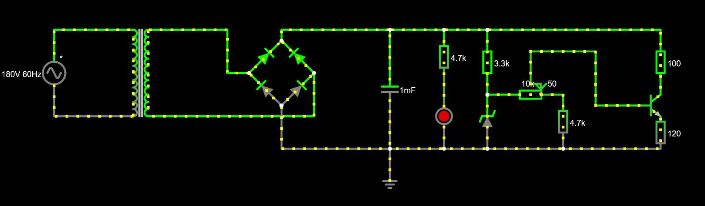

# Projeto Fonte de Tensão Ajustável - 3V a 12V; 100mA;

> Projeto desenvolvido para a disciplina de Eletrônica para Computação — [USP-ICMC] · [2026.1]

---

## Integrantes

| Nome | NUSP |
|------|------|
| Luís Henrique Varela Medeiros Bezerra | 17908549 |
| Henrique Rossi Posso | 17868285 |
| Luís Fernando de Oliveira Souza | 17931682 |
| Malick Figueiredo Samoa | 16988652 |

---

## Descrição do Projeto

O projeto é uma fonte de tensão ajustável entre 3V e 12V, a partir de uma entrada AC 127V/60Hz. A montagem foi feita em uma protoboard, com simulação no Falstad para testes prévios e montagem no Eagle.

---

## Diagrama da Fonte



---

## Lista de Componentes

| Qtd | Componente | Valor / Especificação | Preço Unitário | Preço Total |
|-----|------------|----------------------|----------------|-------------|
| 1 | Transformador | 127V → 24V / 1A | R$ 0,00 | R$ 0,00 |
| 10 | Diodo retificador | 1N4007 | R$ 0,20 | R$ 2,00 |
| 1 | Capacitor eletrolítico | 1000 µF / 50V | R$ 6,60 | R$ 6,60 |
| 2 | Capacitor eletrolítico | 470 µF / 25V | R$ 2,00 | R$ 4,00 |
| 1 | Protoboard | BB-01 840 2 Barras | R$ 39,10 | R$ 39,10 |
| 3 | Diodo zener | 1N5243 / 13V½ ½W | R$ 0,40 | R$ 1,20 |
| 3 | Resistor | 4.7kΩ / 1W | R$ 0,40 | R$ 1,20 |
| 10 | Resistor | 1kΩ / ½W | R$ 0,07 | R$ 0,70 |
| 1 | Resistor | 3.3kΩ / 1/2W | R$ 0,00 | R$ 0,00 |
| 3 | Resistor | 100Ω / 5W | R$ 1,98 | R$ 5,94 |
| 3 | LED indicador | Vermelho 5mm | R$ 0,50 | R$ 1,50 |
| 3 | Transistor | 2N2222A NPN / 60V 0,8A | R$2,60 | R$7,80 |
| 2 | Pacote Jumper macho x macho | Kit 10pcs | R$7,00 | R$14.00 |
| 1 | Potenciômetro | 1W B10K / B-16,5XE-20XR-7MM | R$ 7,00 | R$ 7,00 |
| | | | **Total** | **R$ 89,84** |

---

OBS: os componentes cujo valores estão zerados foram emprestados ou cedidos por outros alunos ou pelo professor, e não utilizamos os capacitores de 470uF 25V;

## Justificativa dos Valores Escolhidos

- **Transformador:** _Escolhemos o transformador 2 da planilha do Simões._
- **Capacitor:** _Escolhemos o capacitor de 1000uF para garantir um ripple pequeno, e de 50V para aguentar com muita folga a tensão que pode passar por ele. O ripple mínimo era de 10%. O cálculo do ripple e da capacitância mínima será detalhado mais abaixo._
- **Resistores:** _Testamos os valores na simulação do falstad e decidimos pelos de 4.7k, e após teste real, trocamos um deles por de 3.3 para cumprir melhor as exigências do projeto._

---

## Cálculo do ripple e da capacitância mínima.

- Inserir aqui;

---

## Simulação no Falstad

Acesse o circuito simulado clicando no link abaixo:

🔗 **[Abrir simulação no Falstad](https://www.falstad.com/circuit/circuitjs.html?ctz=COLE_SEU_LINK_AQUI)**

> _Para gerar o link: no Falstad, vá em **File → Export as Link** e cole aqui._

---

## Projeto no EAGLE

Os arquivos do esquemático e da PCB estão disponíveis na pasta [`/eagle`](./eagle/):

```
eagle/
├── fonte.sch        # Esquemático
├── fonte.brd        # Layout da PCB
└── fonte.pdf        # Exportação em PDF
```

### Esquemático


### Layout da PCB


---

## 📸 Fotos do Circuito Montado

### Protoboard


### Placa Final (PCB)


> _Adicione quantas fotos achar necessário. Recomendado: frente, verso, e detalhe dos componentes._

---

## Vídeo do Projeto

Assista ao vídeo de apresentação do projeto, onde explicamos o funcionamento, a simulação e a justificativa dos valores escolhidos:

[](https://www.youtube.com/watch?v=SEU_LINK_AQUI)

🔗 **[Assistir no YouTube](https://www.youtube.com/watch?v=SEU_LINK_AQUI)**  
_(ou [Google Drive](https://drive.google.com/SEU_LINK_AQUI) caso prefira)_

**O vídeo cobre:**
- Demonstração da simulação no Falstad
- Explicação dos cálculos e escolha dos componentes
- Funcionamento do circuito real na protoboard/placa
- Medições com multímetro

---

## Estrutura do Repositório

```
/
├── README.md
├── eagle/
│   ├── fonte.sch
│   ├── fonte.brd
│   └── fonte.pdf
└── imagens/
    ├── diagrama_fonte.png
    ├── esquematico_eagle.png
    ├── pcb_eagle.png
    ├── protoboard_01.jpg
    ├── protoboard_02.jpg
    ├── placa_montada.jpg
    └── thumbnail_video.png
```

---

## 📚 Referências

- [Datasheet — LM317](https://www.ti.com/product/LM317)
- [Datasheet — 1N4007](https://www.vishay.com/docs/88503/1n4001.pdf)
- [Simulador Falstad](https://www.falstad.com/circuit/)
- [EAGLE — Autodesk](https://www.autodesk.com/products/eagle/overview)
- _Adicione livros, slides da disciplina ou outros materiais consultados_
