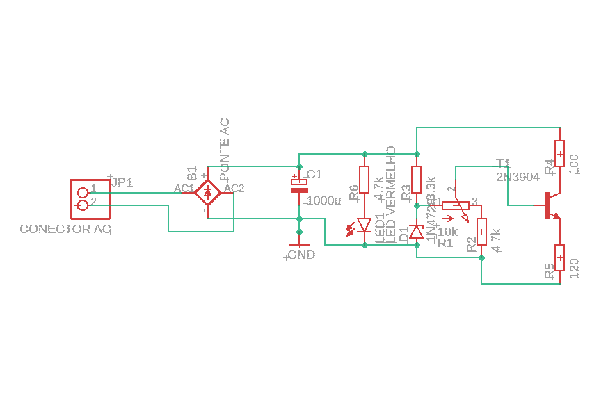
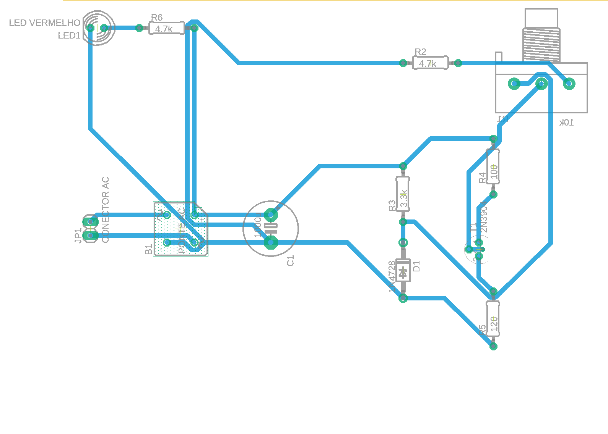
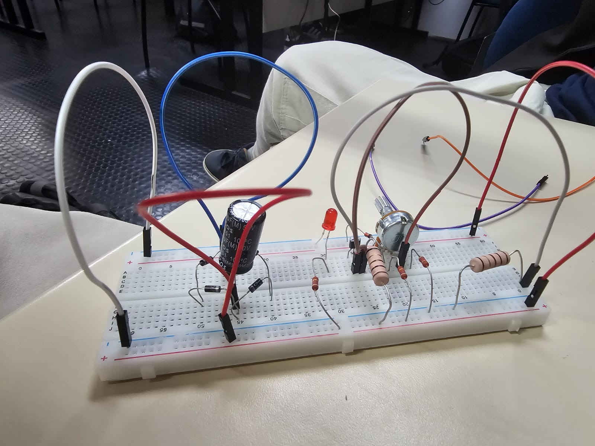
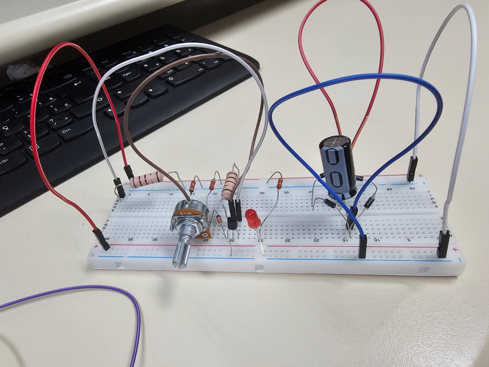

# Projeto Fonte de Tensão Ajustável - 3V a 12V; 100mA;

> Projeto desenvolvido para a disciplina de Eletrônica para Computação — [USP-ICMC] · [2026.1]

---

## Integrantes

| Nome | NUSP |
|------|------|
| Luís Henrique Varela Medeiros Bezerra | 17908549 |
| Henrique Rossi Posso | 17868285 |
| Luís Fernando de Oliveira Souza | 17931682 |
| Malick Figueiredo Samoa | 16988652 |

---

## Descrição do Projeto

O projeto é uma fonte de tensão ajustável entre 3V e 12V, a partir de uma entrada AC 127V/60Hz. A montagem foi feita em uma protoboard, com simulação no Falstad para testes prévios e montagem no Eagle.

---

## Lista de Componentes

| Qtd | Componente | Valor / Especificação | Preço Unitário | Preço Total |
|-----|------------|----------------------|----------------|-------------|
| 1 | Transformador | 127V → 24V / 1A | R$ 0,00 | R$ 0,00 |
| 10 | Diodo retificador | 1N4007 | R$ 0,20 | R$ 2,00 |
| 1 | Capacitor eletrolítico | 1000 µF / 50V | R$ 6,60 | R$ 6,60 |
| 2 | Capacitor eletrolítico | 470 µF / 25V | R$ 2,00 | R$ 4,00 |
| 1 | Protoboard | BB-01 840 2 Barras | R$ 39,10 | R$ 39,10 |
| 3 | Diodo zener | 1N5243 / 13V½ ½W | R$ 0,40 | R$ 1,20 |
| 3 | Resistor | 4.7kΩ / 1W | R$ 0,40 | R$ 1,20 |
| 10 | Resistor | 1kΩ / ½W | R$ 0,07 | R$ 0,70 |
| 1 | Resistor | 3.3kΩ / 1/2W | R$ 0,00 | R$ 0,00 |
| 3 | Resistor | 100Ω / 5W | R$ 1,98 | R$ 5,94 |
| 3 | LED indicador | Vermelho 5mm | R$ 0,50 | R$ 1,50 |
| 3 | Transistor | 2N2222A NPN / 60V 0,8A | R$2,60 | R$7,80 |
| 2 | Pacote Jumper macho x macho | Kit 10pcs | R$7,00 | R$14.00 |
| 1 | Potenciômetro | 1W B10K / B-16,5XE-20XR-7MM | R$ 7,00 | R$ 7,00 |
| | | | **Total** | **R$ 89,84** |

---

OBS: os componentes cujo valores estão zerados foram emprestados ou cedidos por outros alunos ou pelo professor, e não utilizamos os capacitores de 470uF 25V;

## Justificativa dos Valores Escolhidos

- **Transformador:** _Escolhemos o transformador 2 da planilha do Simões._
- **Capacitor:** _Escolhemos o capacitor de 1000uF para garantir um ripple pequeno, e de 50V para aguentar com muita folga a tensão que pode passar por ele. O ripple mínimo era de 10%. O cálculo do ripple e da capacitância mínima será detalhado mais abaixo._
- **Resistores:** _Testamos os valores na simulação do falstad e decidimos pelos de 4.7k, e após teste real, trocamos um deles por de 3.3 para cumprir melhor as exigências do projeto._

---

## Cálculo do ripple e da capacitância mínima.

Após a retificação em ponte, a frequência da tensão pulsante passa a ser o dobro da frequência da rede. Assim, para uma rede de $60\text{ Hz}$,

$$
f_r = 2f = 120 \text{ Hz}
$$

A tensão no capacitor, lida diretamente no simulador Falstad, é:

$$
V_c = 26\text{ V}
$$

Admitindo corrente aproximadamente constante durante a descarga do capacitor, a partir da relação

$$
I=C\frac{dV}{dt},
$$

obtém-se a expressão aproximada para o ripple pico a pico:

$$
V_{r(pp)}=\frac{I}{f_rC}
$$

Na simulação, a corrente média medida no circuito foi de $32{,}074\text{ mA}$. Fixando um ripple máximo admissível de $10\%$ de $V_c$ e usando essa corrente:

$$
V_{r(pp)} = 0{,}10\times V_c = 0{,}10\times26 = 2{,}6\text{ V}
$$

a capacitância mínima necessária é

$$
C_{\min}=\frac{I}{f_rV_{r(pp)}}
=\frac{0{,}032074}{120\times2{,}6}
\approx1{,}03\times10^{-4}\text{ F}
=102{,}8\text{ }\mu\text{F}
$$

Como o valor comercial utilizado no projeto é $1000\text{ }\mu\text{F}$ (quase $10\times$ acima do mínimo), o ripple real obtido é bem menor:

$$
V_{r(pp)} = \frac{0{,}032074}{120\times1000\times10^{-6}} \approx 0{,}267\text{ V}
$$

o que corresponde a aproximadamente $1\%$ de $V_c$.

Portanto, para as condições simuladas, obtém-se um ripple aproximado de

$$
\boxed{V_{r(pp)}\approx0{,}27\text{ V}}
$$


---

## Simulação no Falstad


Acesse o circuito simulado clicando no link abaixo:

🔗 **[Abrir simulação no Falstad](https://is.gd/5gRgDR)**

---

## Projeto no EAGLE

Os arquivos do esquemático e da PCB estão disponíveis na pasta [`/eagle`](./eagle/):

```
eagle/
├── fonte.sch        # Esquemático
├── fonte.brd        # Layout da PCB
└── fonte.epf        # Arquivo do projeto no Eagle
```

### Esquemático



### Layout da PCB



---

## 📸 Fotos do Circuito Montado

### Protoboard






---

## Vídeo do Projeto

Assista ao vídeo de apresentação do projeto, onde explicamos o funcionamento e os componentes do circuito:


[](https://youtu.be/PK1tTYSEvVs)

E assista também o vídeo de demonstração de funcionamento do circuito, com o ajuste de 3V a 12V:

[](https://youtube.com/shorts/UHSr5U2GHTw?si=HNl6-A2dgLyBt7AU)

---


## 📚 Referências

- [Datasheet — LM317](https://www.ti.com/product/LM317)
- [Datasheet — 1N4007](https://www.vishay.com/docs/88503/1n4001.pdf)
- [Simulador Falstad](https://www.falstad.com/circuit/)
- [EAGLE — Autodesk](https://www.autodesk.com/products/eagle/overview)

- OBS: O Eagle foi descontinuado pela autodesk. Conseguimos fazer o projeto nele um pouco antes disso, mas é melhor utilizar outros aplicativos indicados pelo professor agora.
